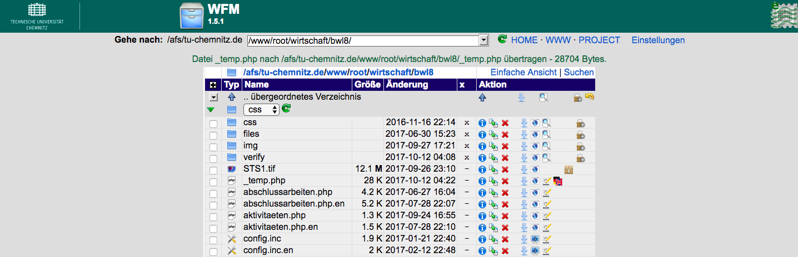

# BWL8 Webstie Documentation

### How to access files on the TUC server

1. Access TU Chemnitz server login page through: https://login.tu-chemnitz.de/

2. Click "Zugriff auf Dateien via Dateimanager WFM


3. On the top of input bar enter ``` /www/root/wirtschaft/bwl8/ ``` to move to bwl8 directory


4. Under bwl8 directory, it lists all files for hosting bwl8 websites


### Files structure

#### Folders description

<!-- img -->


- CSS - style sheets
- files - text files, pdf, slides, words etc.
- img - photos
- verify - verify php files, used on ```https://www.tu-chemnitz.de/wirtschaft/bwl8/lehrangebote.php``` for encoding the page

1. the most frequently used folders are ```files``` and ```img```

2. each file with ```[filename].php``` extended name represents a single file on the website, which can be accessed with url ``` https://www.tu-chemnitz.de/wirtschaft/bwl8/ + [filename].php ```

3. to access the english website, just add ```.en``` behind the original file: ``` https://www.tu-chemnitz.de/wirtschaft/bwl8/ + [filename].php.en ```

### How to attach an url 

1. basic form of url
```
<a href="url-link">url description</a>
```

2. wrap url into a paragraph
```
<p>write some paragraph here<a href="url-link-directory">url description</a></p>
```

3. example:


### How to attach an image

1. upload images to "img" directory


2. link image url into HTML
```

```

src means the path of image

3. a image link:
```
<a href="/">MDN</a>
```

4. default images path on bwl8 should look like: ``` img/[imagename] ```

### How to upload files

1. upload file into "files" directory


2. link file url into HTML. it's noramlly done with ```<a>``` tag
```
<p>- Eine Abschlussarbeit zur <a href="files/Unbenannte Anlage 00046.pdf" target="_blank">&Ouml;kobilanz</a>> some tex...</p>
```

3. defualt files path on bwl8 should look like: ``` files/[filesname] ```

### Tucal environment description

1. establish a new page: ```https://www.tu-chemnitz.de/urz/www/rahmen.html#allg```

2. tucal varibale configuration: ```https://www.tu-chemnitz.de/urz/www/rahmen.html#var```

3. establish multiple languages pages: ```https://www.tu-chemnitz.de/urz/www/rahmen.html#mehrsprachig```

## Reference 

1. TUCAL official documentation: ```https://www.tu-chemnitz.de/urz/www/tucal.html```

2. Some common used tags on BWL8 website:

- add a link with tag ```<a>```: ```https://developer.mozilla.org/en-US/docs/Web/HTML/Element/a```

- add an image with tag ``````: ```https://developer.mozilla.org/en-US/docs/Web/HTML/Element/img```

- a break line tag ```<hr>```: ```https://developer.mozilla.org/en-US/docs/Web/HTML/Element/hr```

- table tag ```<table>```: ```https://developer.mozilla.org/en-US/docs/Web/HTML/Element/table```

- gives text strong importance tag ```<strong>```: ```https://developer.mozilla.org/en-US/docs/Web/HTML/Element/strong```s

3. it's good to know some knowledge of bootstrap, which is the core layout framework applied on tucal: ```http://getbootstrap.com/```